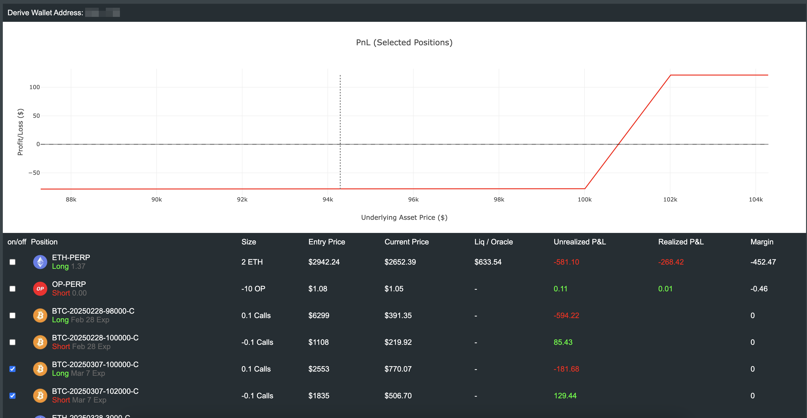

### PnL charts for https://www.derive.xyz/ options & perps positions

Use your Derive Wallet address from https://www.derive.xyz/developers and MetaMask to login.

**Alpha version, this project was created for my own usage, use at your own risk!** 

---
### How to use
- start local server
- open `index.html` in your browser
- enter your Derive Wallet address
- connect your MetaMask wallet and sign message (use wallet registered on https://www.derive.xyz/developers)

Select position(s) to see PnL chart. 

---
### Licenses

This project uses the following libraries:

- jQuery (MIT License)
- MetaMask SDK (MIT License)
- ethers.js (MIT License)
- Plotly.js (MIT License)